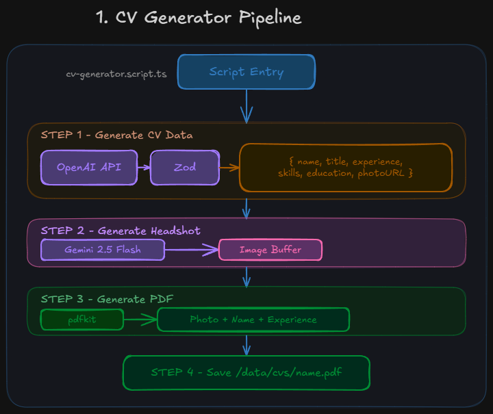
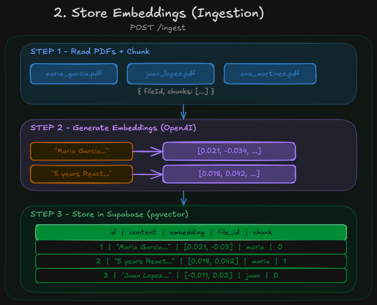

# CV Screener AI


> An intelligent assistant that lets you query a collection of PDF CVs using natural language. Ask about candidates' skills, experience, education, or compare profiles powered by RAG with semantic search.

---
## Demo

https://github.com/user-attachments/assets/7f787052-0441-412d-92ba-c7fa23444968

---

## Tech Stack

| Layer            | Technology                                        |
| ---------------- | ------------------------------------------------- |
| **Backend**      | Express + TypeScript                              |
| **Frontend**     | React + Next.js + shadcn/ui                       |
| **LLMs**         | GPT-4o-mini + Gemini 2.5 Flash (image generation) |
| **Vector DB**    | PostgreSQL + Supabase + pgvector                  |
| **AI Framework** | Vercel AI SDK (streaming + UI components)         |

---

## Architecture

### CV Generator Script



### Store Embeddings (PDF to Vector DB)



### Chat Flow (RAG - Semantic Search)


---

## Project Structure

```
backend/
├── index.ts                 # Express server entry point
├── config/                  # Environment & service configs
├── data/cvs/                # PDF CVs storage
├── db/migrations/           # Supabase vector DB setup
├── modules/
│   ├── chat/                # RAG chat endpoint
│   └── ingest/              # PDF parsing + embeddings + vector storage
├── scripts/cv-generator/    # Synthetic CV generation
├── services/
│   ├── google-gen-ai/       # Gemini (image generation)
│   └── openai/              # OpenAI (embeddings + LLM)
└── utils/
```

---

## Prerequisites

- **Node.js** v20.16.0 or higher
- **Supabase account** with pgvector enabled
- **OpenAI API key**
- **Google Gemini API key**

---

## Quick Start

### 1. Clone and configure

```bash
git clone https://github.com/yourusername/cv-screener-ai.git
cd cv-screener-ai
```

Create a `.env` file in the `backend/` folder:

```env
# Supabase (Vector Database)
SUPABASE_URL=your_supabase_url
SUPABASE_ANON_KEY=your_supabase_anon_key

# AI APIs
OPENAI_API_KEY=your_openai_api_key
GOOGLE_GENERATIVE_AI_API_KEY=your_google_api_key

# Server
PORT=3001
FRONTEND_URL=http://localhost:3000

# Paths
CVS_PATH=./data/cvs
```

### 2. Supabase Setup

1. Create a free account at [supabase.com](https://supabase.com) and create a new project
2. Go to **Project Settings > API** and copy your `Project URL` and `anon public` key into your `.env`
3. Go to **SQL Editor** and run the migration at [`backend/db/migrations/001_create_cv_chunks.sql`](backend/db/migrations/001_create_cv_chunks.sql) — this enables pgvector, creates the `cv_chunks` table, and registers the `match_cv_chunks` RPC function used for semantic search

### 3. Run backend

```bash
cd backend
npm install
npm run dev
```

### 4. Run frontend

```bash
cd frontend
npm install
npm run dev
```

### 5. Ingest CVs into Vector DB

Place your PDFs in `/backend/data/cvs/`, then:

```bash
npm run ingest
```

### 6. (Optional) Generate synthetic CVs

```bash
cd backend
npm run generate:cvs
```

This generates PDF CVs with AI-created data and headshots.

### Access

- **Frontend:** http://localhost:3000
- **Backend API:** http://localhost:3001

---

## Design Decisions

| Decision                          | Why                                                       |
| --------------------------------- | --------------------------------------------------------- |
| Supabase + pgvector over ChromaDB | Cloud-hosted, zero infra management, free tier available  |
| Multi-model (OpenAI + Gemini)     | Each model for its strength: structured text vs image gen |
| Zod structured output             | Type-safe LLM responses, eliminates parsing errors        |
| Vercel AI SDK                     | Native streaming + React hooks, fast UI implementation    |
| Batch embedding ingestion         | Single API call for all chunks, reduces cost and latency  |

---

## Example Usage

> "Which candidates have experience with React and more than 3 years of work?"

> "Compare the backend skills of all candidates"

> "Who would be the best fit for a senior full-stack role?"

---

## License

MIT

---

## Connect with me

[](https://www.linkedin.com/in/ivan-escribano-dev)
[](mailto:ivanescribano1998@gmail.com)
[](https://x.com/IvanEscribano98)
[](https://github.com/ivan-escribano)
[](https://ivanescribano.substack.com)
[](https://medium.com/@ivanescribano1998)
