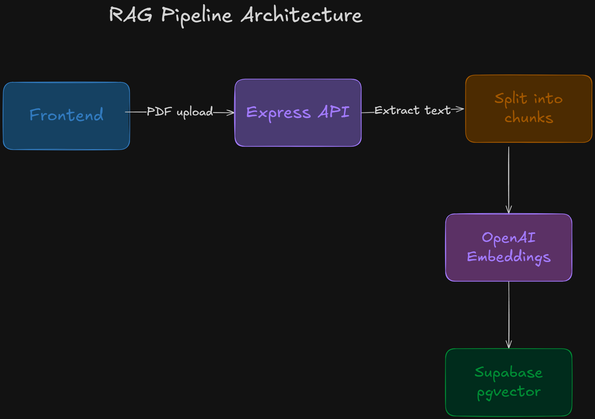

# CV Screener AI


An AI-powered assistant that lets you upload PDF CVs and query them using natural language. Ask about candidates' skills, experience, or compare profiles — powered by RAG with semantic search.

---

## Demo

https://github.com/user-attachments/assets/bd877c24-745b-45f4-a6ea-1bca9cc4e38e

---

## Example Queries

> "Who has experience with React and TypeScript?"

> "Find candidates with more than 5 years of experience"

> "Which candidate is the best fit for a backend role?"

> "Compare the top 3 candidates by technical skills"

---

## Features

- **Upload & manage CVs** — Drag and drop PDF resumes, view them in a sortable table, delete with confirmation
- **AI chat with RAG** — Ask questions in natural language, get answers grounded in your actual CV data
- **Semantic search** — Finds relevant candidates even when the exact keywords don't match
- **Source citations** — Every answer shows which CVs were used, with relevance scores
- **Real-time streaming** — Responses stream token by token for a fast, responsive experience
- **Synthetic CV generator** — Generate realistic test CVs with AI-created data and headshots

---

## Project Structure

```
backend/
├── index.ts                    # Express server entry point
├── config/                     # Environment & service configs
├── data/cvs/                   # PDF CVs storage
├── db/migrations/              # Supabase vector DB setup
├── modules/
│   ├── chat/                   # RAG chat endpoint
│   ├── cvs/                    # CV management (list, delete)
│   └── ingest/                 # PDF parsing + embeddings
├── scripts/cv-generator/       # Synthetic CV generation
├── services/
│   ├── google-gen-ai/          # Gemini (image generation)
│   └── openai/                 # OpenAI (embeddings + LLM)
└── utils/

frontend/
├── src/
│   ├── api/                    # API clients and DTOs
│   ├── app/
│   │   ├── chat/               # Chat page
│   │   └── cvs/                # CVs page
│   ├── components/
│   │   ├── ai-elements/        # Vercel AI SDK UI components
│   │   ├── custom/
│   │   │   ├── chatbot/        # Chat interface + sub-components
│   │   │   ├── cv-list/        # Sortable table + sub-components
│   │   │   ├── cv-uploader/    # File upload + dialog
│   │   │   └── sidebar/        # Navigation sidebar
│   │   └── ui/                 # shadcn/ui primitives
│   └── config/                 # App-wide constants
```

### Architecture

#### RAG Pipeline Architecture



#### Chat Flow — RAG with Semantic Search


#### Store Embeddings


#### CV Generator Pipeline (Optional)


### Tech Stack

| Layer            | Technology                                |
| ---------------- | ----------------------------------------- |
| **Frontend**     | Next.js, React, shadcn/ui, Tailwind CSS   |
| **Backend**      | Express, TypeScript                       |
| **AI / LLMs**    | OpenAI GPT-5-mini, Gemini 2.5 Flash       |
| **Vector DB**    | PostgreSQL, Supabase, pgvector            |
| **AI Framework** | Vercel AI SDK (streaming + UI components) |

### Getting Started

#### Prerequisites

- Node.js v20.16.0+
- Supabase account with pgvector enabled
- OpenAI API key
- Google Gemini API key

#### 1. Clone and configure

```bash
git clone https://github.com/yourusername/cv-screener-ai.git
cd cv-screener-ai
```

Create `.env` in the `backend/` folder:

```env
SUPABASE_URL=your_supabase_url
SUPABASE_ANON_KEY=your_supabase_anon_key
OPENAI_API_KEY=your_openai_api_key
GOOGLE_GENERATIVE_AI_API_KEY=your_google_api_key
PORT=3001
FRONTEND_URL=http://localhost:3000
CVS_PATH=./data/cvs
```

#### 2. Supabase setup

1. Create a free account at [supabase.com](https://supabase.com) and start a new project
2. Go to **Project Settings → API** and copy:
   - `Project URL` → paste as `SUPABASE_URL` in your `.env`
   - `anon public` key → paste as `SUPABASE_ANON_KEY` in your `.env`
3. Go to **SQL Editor**, click **New Query**, and paste the contents of [`backend/db/migrations/001_create_cv_chunks.sql`](backend/db/migrations/001_create_cv_chunks.sql)
4. Click **Run** — this enables the `pgvector` extension, creates the `cv_chunks` table, and registers the `match_cv_chunks` function used for semantic search

#### 3. Run the app

```bash
# Backend
cd backend && npm install && npm run dev

# Frontend (in another terminal)
cd frontend && npm install && npm run dev
```

#### 4. (Optional) Ingest CVs via script

Place PDFs in `backend/data/cvs/`, then:

```bash
cd backend && npm run ingest
```

#### 5. (Optional) Generate synthetic CVs

```bash
cd backend && npm run generate:cvs
```

**Access:** Frontend at `http://localhost:3000` · API at `http://localhost:3001`

---

## License

MIT

---

## Connect with me

[](https://www.linkedin.com/in/ivan-escribano-dev)
[](mailto:ivanescribano1998@gmail.com)
[](https://x.com/IvanEscribano98)
[](https://github.com/ivan-escribano)
[](https://ivanescribano.substack.com)
[](https://medium.com/@ivanescribano1998)
